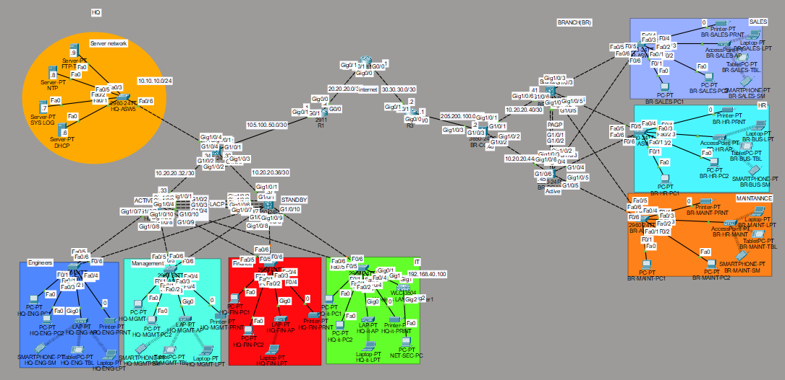

# Enterprise Network Design & Implementation (HQ & Branch)

## 👨‍💻 Author
Youssef Magdy Fakhry  
Junior Network & Cybersecurity Engineer  

---

## 📌 Project Overview
This project demonstrates the design and implementation of a full enterprise network simulating a Headquarters (HQ) and Branch (BR) environment.

The network was built using Cisco technologies with a focus on scalability, security, and high availability.

---

## 🧱 Network Design
- Hierarchical Design (Core / Distribution / Access)
- Multi-site architecture (HQ & Branch)

---

## ⚙️ Technologies Used
### 🔹 Routing
- OSPF (Area 0)
- Static Routing

### 🔹 Switching
- VLANs
- VTP v2
- STP / RSTP
- Inter-VLAN Routing (SVI)

### 🔹 Redundancy
- HSRP
- EtherChannel (LACP & PAgP)

### 🔹 Security
- ACLs (Extended)
- Port Security (Sticky MAC)
- DHCP Snooping
- Dynamic ARP Inspection (DAI)
- SSH (Secure Remote Access)

### 🔹 Services
- DHCP Server
- Syslog Server
- NTP
- TFTP

### 🔹 Wireless
- WLC (Wireless LAN Controller)
- Lightweight APs (HQ)
- Standalone APs (Branch)

---

## 🛠 Tools & Platforms
- Cisco Packet Tracer
- GNS3
- Real Cisco Routers & Switches

---

## 🧪 Testing & Verification
- Full connectivity between all VLANs and sites
- DHCP working across all networks
- Redundancy tested (HSRP failover)
- Security policies verified

---

## 📸 Screenshots
- ## Network Topology

---

## 📂 Project Files

- 📦 [Download Packet Tracer File](project.pkt)  
- ⚙️ Device Configurations file

- 📄 [View Full Report](report.pdf)

---

## 🚀 Key Achievements
- Designed scalable enterprise network
- Implemented full security features
- Achieved high availability and redundancy
- Hands-on deployment using real devices

